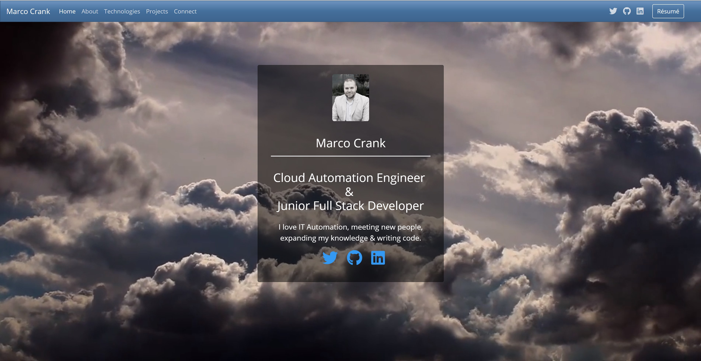
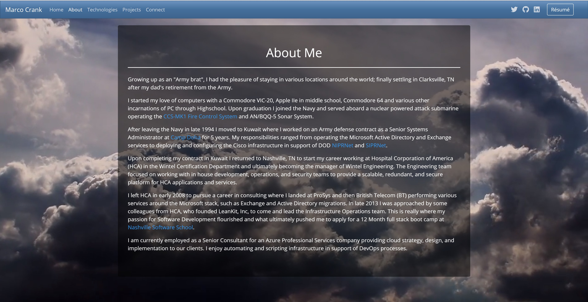
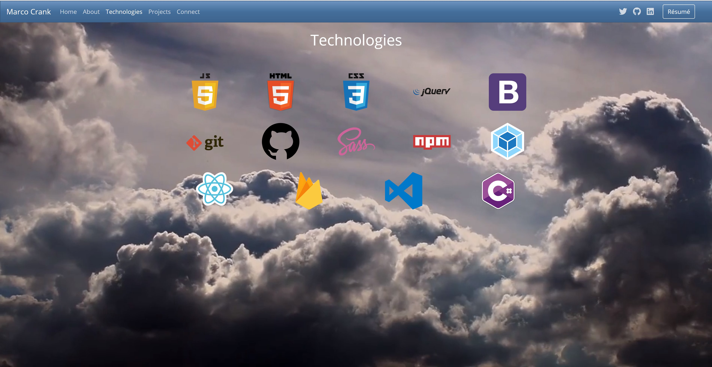
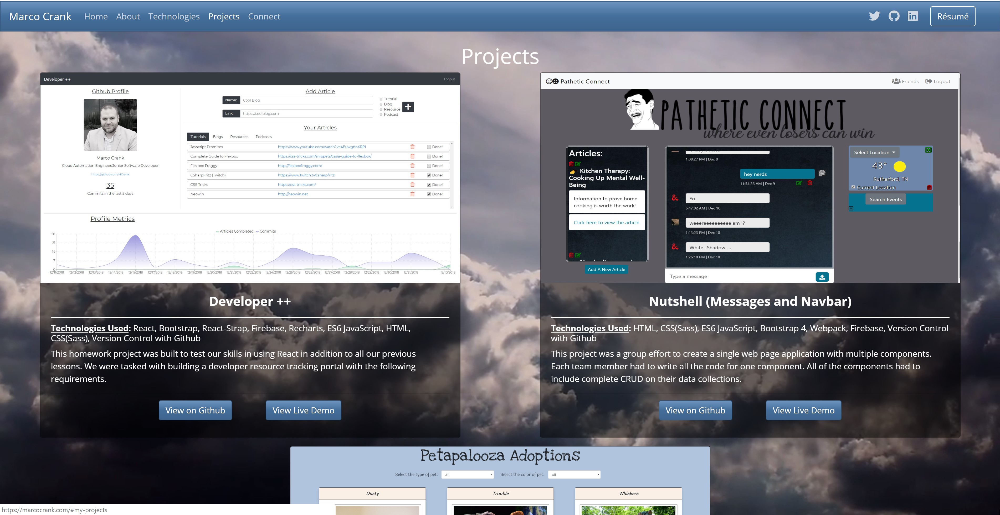
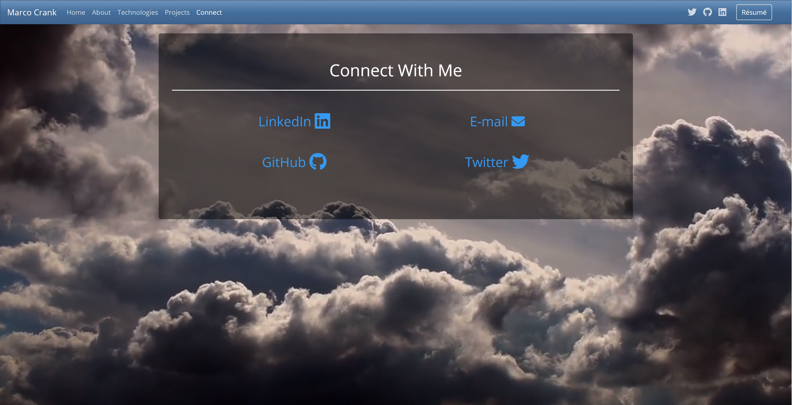

# Personal Bio Site

### <https://marcocrank.com>

This project was built to test our skills we have learned over the past 6 months in the front end development bootcamp. The project started out as just vanilla JavaScript/html/CSS and as we learned new technologies and skills we updated this project as time progressed. This site is a showcase of some of the projects I have completed over the past 6 months (Aug 2018 - Jan 2018) both by myself and in a group/team environment using the knowledge gained from the bootcamp. It also details a little bit about my background and offers my resume for download.

## Requirements

- Create a personal biography site using the technologies and skills learned in the course to promote ourselves and showcase several of our projects.

## Screenshot

#### Homepage

#### About Page

#### Technologies Page

#### Project Page

#### Connect Page

## How to run this project

### Requirements

- Firebase Account - (https://firebase.google.com/)
- Windows Users may need to install _**win-node-env**_ globally or as optional dependency to the project
  - `npm install -g win-node-env`
  - `npm install --save-optional win-node-env`

### Start Project

- Setup Firebase
  - Create a project
  - Create a Firebase **Realtime Database** (Not Firestore)
  - Set `.write` rule to `false`
  - Import `!base.json` file into Database to set up collections
  - Import `projects.json` and `tech.json` into respective collections
- Clone the repo
- Browse to the repo directory in your terminal
- Type `npm install` to install dependencies
- Type `npm start` to run the project at [http://localhost:8080](http://localhost:8080)
